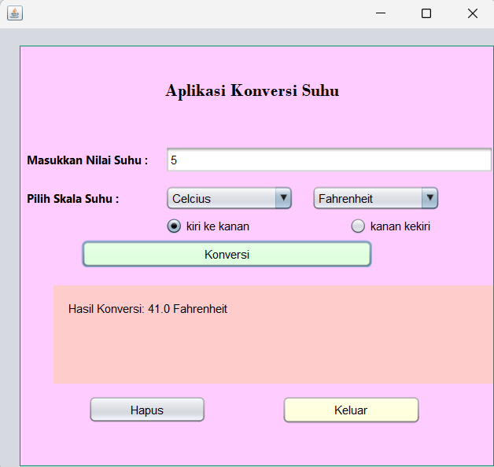

# Aplikasi Konversi Suhu
 Tugas 2 - Novita Fitria Ratnawati (2210010228)
 
# Aplikasi Konversi Suhu 
 
Aplikasi Konversi Suhu Adalah Konversi Untuk Suhu Celcius, Fahrenheit, Reamur, dan Kelvin Dengan Memasukkan Inputan Angka Di Awal Dan Memilih Suhu Mana Yang Mau Di KOnversi 

# Keunggulan Aplikasi

- Konversi Suhu: Aplikasi ini adalah untuk mengkonversi 4 Suhu Yaitu, Celcius, Fahrenheit, Kelvin, Reamur

# Pembuat Aplikasi
 Novita Fitria Ratnawati - 2210010228 - Tugas 2 

# Fitur

Aplikasi ini menawarkan fitur:
 
Konversi Suhu Celcius, Fahrenheit, Kelvin, Reamur

## Cara Menjalankan

1. Run File
2. Ketikkan Angka Yang Kita Input
3. Tekan Suhu Yang Kita Konversi, Kemudian Pada Combo Box Pilih Suhu Yang Mau Di Konversi, Kemudian Tekan Radio Button, lalu tekan Konversi Pada Tombol Button Konversi, Maka Hasil Akan Tampil
4. Tekan Buttton Hapus, Jika ingin mengulang
4. Tekan Button Keluar, jika ingin keluar 

# Demo
